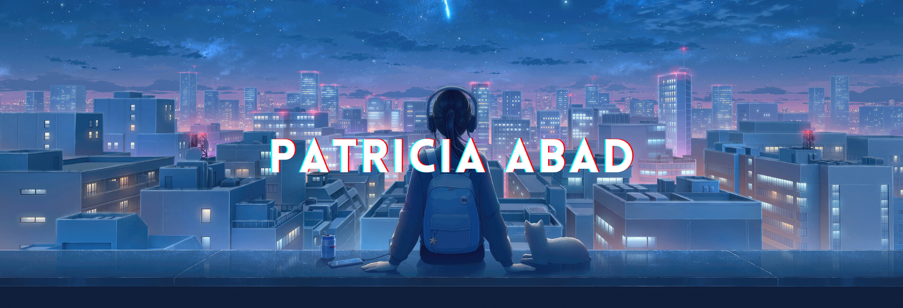

<h2 align="center">
Hi there 👋 I'm Patricia!   I’m currently studying on becoming a web developer.
</h2>

 

<h2>About me :stars:</h2>

<!--- Web illustrations by Storyset ( https://storyset.com/web ) --->

- 👩‍💻 I'm a passionate web development student who transitioned from the audiovisual 🎥 sector to the exciting field of web development. 

- 🌱 I’m currently learning:   

- 🎯 My goal is to get really good at web development and become a skilled and adaptable web developer. 

- :cherry_blossom: Outside of coding, I enjoy spending time in nature 🍂 , photography 📷, playing video games :video_game:, and spending time with my dog :wolf:. 

##
